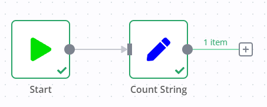
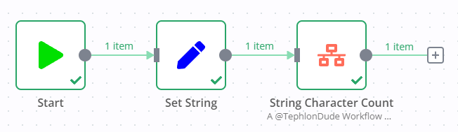

# String Character Counter
This workflow will read the input value of the `string` key and determine how many characters are in this string. It will then output this value as `stringCount` along with the original string.



# Input and Output

## Expected Input
This workflow expects the following input:
``` JSON
[
  {
    "string": "This is the string"
  }
]
```
The value of `string` can be any string of characters.

## Expected Output
Based on the input, you can expect an output similar to this:
``` JSON
[
  {
    "string": "This is the string",
    "stringCount": 18
  }
]
```
The value of `string` is carried over from the input. The value of `stringCount` is the number of characters in the string value.

### Note
If there are other values that are passed along to the input of the workflow, these values will also be present in the output and are not removed from the result.

# Using this Workflow
To use this workflow, follow these instructions:
1. Prepare your workflow by providing a node that meets the requirements of the [expected input](#expected-input)
2. Copy the node in [Execute Workflow Node](#execute-workflows-node) to your workflow to create the *String Character Count* node
3. Connect the output of your workflow to the input of the *String Character Count* node
4. Test and use accordingly



## Execute Workflow Node
This is the Execute Workflow Node that you can copy and paste into your workflow:
``` JSON
{
  "nodes": [
    {
      "parameters": {
        "source": "url",
        "workflowUrl": "https://raw.githubusercontent.com/TephlonDude/n8n-hosted-workflows/main/workflows/String%20Character%20Counter/String_Character_Counter.json"
      },
      "name": "String Character Count",
      "type": "n8n-nodes-base.executeWorkflow",
      "typeVersion": 1,
      "position": [
        0,
        0
      ],
      "notesInFlow": true,
      "notes": "A @TephlonDude Workflow\nhttps://github.com/TephlonDude/n8n-hosted-workflows/tree/main/workflows/String%20Character%20Counter\n\nExpected Input:\n[\n  {\n    \"string\": \"This is the string\"\n  }\n]\nThe value of string can be any string of characters.\n\nExpected Output:\n[\n  {\n    \"string\": \"This is the string\",\n    \"stringCount\": 18\n  }\n]\n\nThe value of string is carried over from the input. The value of stringCount is the number of characters in the string value.\n\n"
    }
  ],
  "connections": {}
}
```

# Share
If you found this workflow to be useful, please consider sharing about it:

[](http://twitter.com/intent/tweet?text=Add%20an%20entire%20%40n8n_io%20workflow%20written%20by%20%40TephlonDude%20that%20counts%20the%20length%20of%20a%20string%20for%20you%20by%20adding%20a%20single%20node%20to%20your%20workflow!%20%F0%9F%A4%AF%0A%0A%23n8n%20%23automation%0A%0AHere%27s%20how%3A%0Ahttps%3A%2F%2Fgithub.com%2FTephlonDude%2Fn8n-hosted-workflows%2Ftree%2Fmain%2Fworkflows%2FString%2520Character%2520Counter)